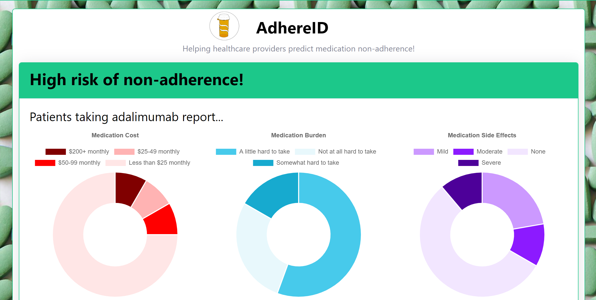

  # AdhereID  
### Predicting medication adherence

Welcome to AdhereID!  This is a project I completed as part of the Insight Health Data Science Program.  
The project structure, background and data sources are described below.  This repository holds the code for the data collection and machine learning modeling.      
    
At the end of the project, I deployed AdhereID as a live app using Flask and AWS EC2.  Check out [this repository](https://github.com/mcglynnk/AdhereID_app) for the Flask app code, and [view the live AdhereID app here](http://adhere-id.com/)!
    
      
    
### Project Structure    
```
code_/   
    functions/ # Custom functions used in n05_final_logreg.py

    # Collecting and cleaning data
      n01_ncpa_import_clean_export.py
      n02_patientslikeme_webscraping.py
      n03_clean_patientslikeme.py

    # Models and model analysis
      n04_eval_models.py              # initial testing of multiple models (by cross-val)
      n05_final_logreg.py             # feature pre-processing, logistic regression model, and hyperparameter tuning
      n05_final_rf.py                 # Random forest model (for comparison)
      n06_feature_importance.py
      n07_model_performance_plots.py

data/
      raw/
      cleaned/

documents/
    # NCPA dataset codebook

notebooks/
    # Jupyter notebook with README information

requirements.txt
```  


### Data Sources

The goal of this project was to develop a machine learning model to predict medication adherence.  Medication non-adherence is a widespread problem in the healthcare industry. About 131 million Americans (half the population!) take at least one prescription medication, and 10~25% of these people don't take their prescription as prescribed.  
   
A tool to predict medication adherence could be used in the doctor's office or pharmacy to determine which patients are at risk for non-adherence; based on this prediction, the healthcare provider could take action to help the patient comply such as providing information on managing side effects, suggesting a pill reminder app, or prescribing a lower-cost or shorter-term treatment.
    
While adherence prediction has been tackled by academia and large healthcare companies alike, typically adherence has been inferred from a combination of electronic health record data and insurance claims data.  In this project, I decided to test whether publicly available demographic and patient-reported medical literacy data could be used in a similar way.
    
I collected two datasets to use for this project:

#### 1.  NCPA (National Community Pharmacists Association) : Medication Adherence Survey (2013)
Phone survey dataset of 1,020 adults in the U.S. See documents/ for the dataset's codebook containing the full list of survey questions.    
- Downloaded from: https://ropercenter.cornell.edu/CFIDE/cf/action/catalog/abstract.cfm?type=&start=&id=&archno=USMISC2013-NCPA&abstract (Accessed 1-14-2020)
- Data format: SPSS
- 1020 rows x 158 columns

#### 2.  PatientsLikeMe
An online community for discussing medical conditions and medications.  
- Web scraped using beautifulsoup (Accessed 1-20-2020, user identifiers not included)
- Data format: data extracted from HTML
- 10,025 rows of drug reviews (adherence, burden(difficulty of taking) and cost) x 11 columns


